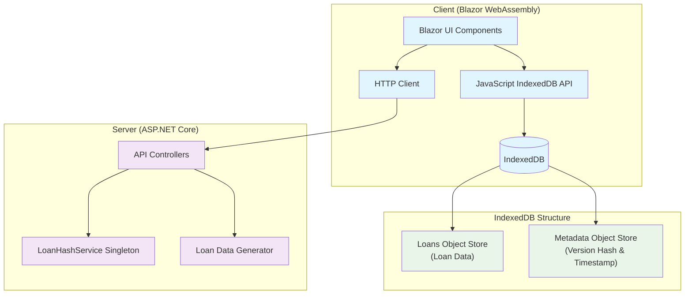
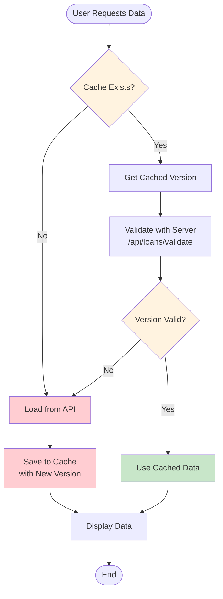
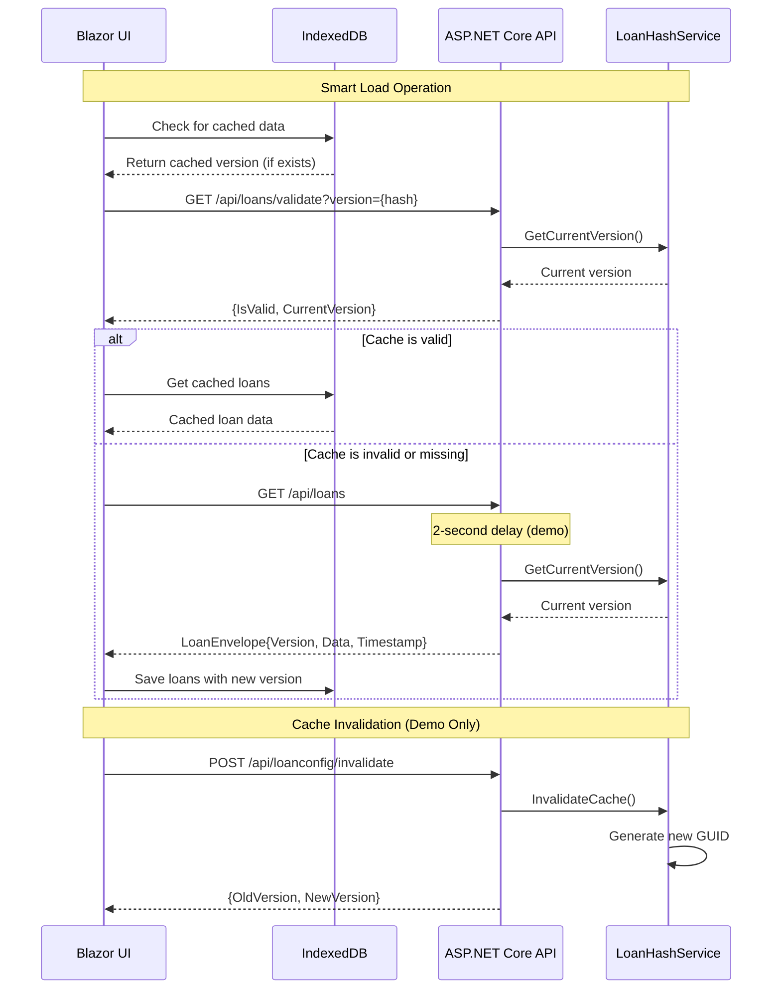
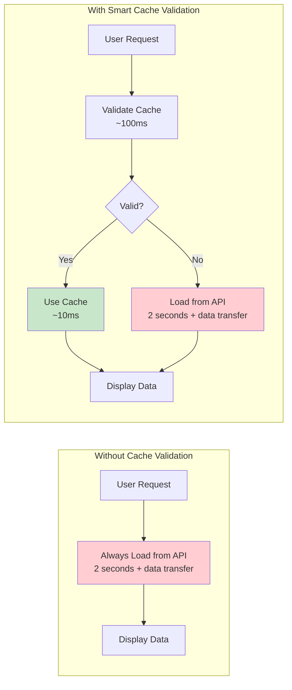

# Blazor IndexedDB Cache Invalidation Demo

## Overview

This Proof of Concept (POC) demonstrates a sophisticated cache invalidation mechanism for web applications using Blazor WebAssembly, ASP.NET Core, and IndexedDB. The system implements version-based cache validation to ensure data freshness while maximizing performance through intelligent caching.

## Key Concepts

The application treats the loan dataset as an atomic unit and uses GUID-based versioning to efficiently validate cache freshness. When data changes server-side, the version changes, automatically invalidating client-side caches.

## System Architecture



## Core Components

### Backend Components

#### 1. LoanEnvelope
**Purpose**: Wrapper class that packages loan data with version information and timestamp.

```csharp
public class LoanEnvelope
{
    public string Version { get; set; }           // GUID-based version hash
    public IEnumerable<Loan> Data { get; set; }   // Actual loan data
    public DateTime Timestamp { get; set; }       // When data was generated
}
```

#### 2. LoanHashService (Singleton)
**Purpose**: Manages the current data version throughout the application lifetime.

- **GetCurrentVersion()**: Returns current GUID version
- **InvalidateCache()**: Generates new GUID version
- **ResetToFresh()**: Alias for cache invalidation

**Important**: Registered as singleton to maintain version consistency across all requests.

#### 3. API Controllers

##### LoansController
- **GET /api/loans**: Returns loan data wrapped in LoanEnvelope with 2-second delay
- **GET /api/loans/validate**: Validates if provided version hash is current

##### LoanConfigController
- **POST /api/loanconfig/invalidate**: Forces cache invalidation (changes version)
- **GET /api/loanconfig/version**: Returns current version information
- **POST /api/loanconfig/reset**: Resets cache to fresh state

### Frontend Components

#### 1. IndexedDB Integration (JavaScript)
**File**: `wwwroot/js/indexeddb.js`

**Database Structure**:
- **Loans Object Store**: Stores actual loan data
- **Metadata Object Store**: Stores version hash and timestamp

**Key Functions**:
- `saveLoansWithVersion()`: Stores data and version information
- `getLoans()`: Retrieves cached loan data
- `getCachedVersion()`: Gets stored version hash
- `clearLoans()`: Clears all cached data

#### 2. Blazor UI Component
**File**: `Pages/LoanCacheDemo.razor`

Provides comprehensive demo interface with multiple loading strategies and cache management controls.

## Cache Validation Flow



## API Interaction Sequence



## Demo Features and Controls

### Data Loading Options

1. **Load Fresh from API (2s delay)**: 
   - Always fetches from server
   - Demonstrates API latency
   - Updates cache with fresh data

2. **Smart Load (Cache + Validation)**:
   - **Primary feature**: Validates cache before use
   - Only loads from API if cache is invalid
   - Demonstrates efficiency of cache validation

3. **Force Load from Cache**:
   - Uses cached data without validation
   - Shows cached data state
   - Gracefully handles missing cache

4. **Clear Cache**:
   - Removes all cached data
   - Demonstrates fallback behavior

### Demo Controls ⚠️ **FOR TESTING PURPOSES ONLY**

> **Important Notice**: The following controls are included solely for demonstration and testing purposes. In a production environment, cache invalidation would be triggered by actual business logic (data updates, scheduled refreshes, etc.), not manual user actions.

1. **🔄 Simulate Data Change**:
   - **Purpose**: Demonstrates cache invalidation mechanism
   - **Action**: Changes server-side version hash
   - **Result**: Subsequent cache validations will fail, forcing fresh data load
   - **Real-world equivalent**: Database updates, scheduled data refreshes

2. **📋 Check Server Version**:
   - **Purpose**: Shows current server version vs cached version
   - **Action**: Displays version comparison information
   - **Result**: Helps understand version mismatch scenarios

## Technical Implementation Details

### Version-Based Cache Invalidation Strategy

1. **Atomic Dataset Treatment**: The entire loan dataset is treated as a single unit with one version
2. **GUID Versioning**: Each version is a unique GUID, eliminating collision possibilities
3. **Lightweight Validation**: Only version hash is compared, not full dataset
4. **Automatic Fallback**: System gracefully handles validation failures

### Performance Benefits



### IndexedDB Storage Strategy

**Separate Object Stores**:
- **Loans Store**: Contains actual loan data with auto-incrementing keys
- **Metadata Store**: Contains version hash and timestamp with fixed keys

**Benefits**:
- Efficient version checking without loading large datasets
- Atomic operations for data consistency
- Flexible metadata expansion for future features

### Error Handling and Resilience

1. **Network Failures**: Graceful fallback to cached data when available
2. **Cache Corruption**: Automatic cache clearing and fresh data loading
3. **Version Mismatch**: Transparent fresh data loading
4. **Missing Cache**: Direct API loading without errors

## Configuration and Deployment

### Development Settings

The application includes a 2-second API delay to demonstrate cache performance benefits:

```csharp
// In LoansController.GetLoans()
await Task.Delay(2000); // Remove for production
```

### Production Considerations

1. **Remove API Delays**: Remove demo delays from controllers
2. **Remove Demo Controls**: Remove cache invalidation UI controls
3. **Real Invalidation Logic**: Implement business logic-driven cache invalidation
4. **Error Logging**: Add comprehensive logging for cache operations
5. **Performance Monitoring**: Monitor cache hit/miss ratios

## File Structure

```
BlazorIndexDbDemo/
├── BlazorIndexDbDemo/                 # Server project
│   ├── Controllers/
│   │   ├── LoansController.cs         # Main API endpoint
│   │   └── LoanConfigController.cs    # Demo invalidation endpoint
│   ├── Models/
│   │   └── LoanEnvelope.cs           # Data wrapper with version
│   ├── Services/
│   │   └── LoanHashService.cs        # Version management
│   ├── wwwroot/js/
│   │   └── indexeddb.js              # IndexedDB operations
│   └── Program.cs                    # Service registration
├── BlazorIndexDbDemo.Client/          # Client project
│   └── Pages/
│       └── LoanCacheDemo.razor       # Demo UI component
└── docs/
    └── README.md                     # This documentation
```

## Testing the Implementation

### Manual Testing Steps

1. **Initial Load**: Click "Smart Load" - should load from API (2s delay)
2. **Cache Hit**: Click "Smart Load" again - should load instantly from cache
3. **Cache Invalidation**: Click "Simulate Data Change", then "Smart Load" - should reload from API
4. **Version Comparison**: Use "Check Server Version" to see version differences
5. **Cache Clearing**: Use "Clear Cache" to test fallback behavior

### Expected Behaviors

- **First load**: Always takes 2+ seconds (API + processing)
- **Cached load**: Nearly instant (< 100ms)
- **Post-invalidation**: Returns to 2+ seconds for fresh data
- **Status messages**: Clear feedback on data source (cache vs API)

## Future Enhancements

1. **Granular Invalidation**: Per-record or per-category cache invalidation
2. **Background Refresh**: Automatic cache updates in background
3. **Compression**: Data compression for large datasets
4. **Offline Support**: Enhanced offline functionality
5. **Analytics**: Cache performance metrics and monitoring

## Conclusion

This POC demonstrates a production-ready cache invalidation pattern that balances performance with data freshness. The version-based approach is efficient, reliable, and scales well with dataset size. The demo interface provides clear visibility into the caching mechanism, though the manual controls are intended purely for demonstration purposes.